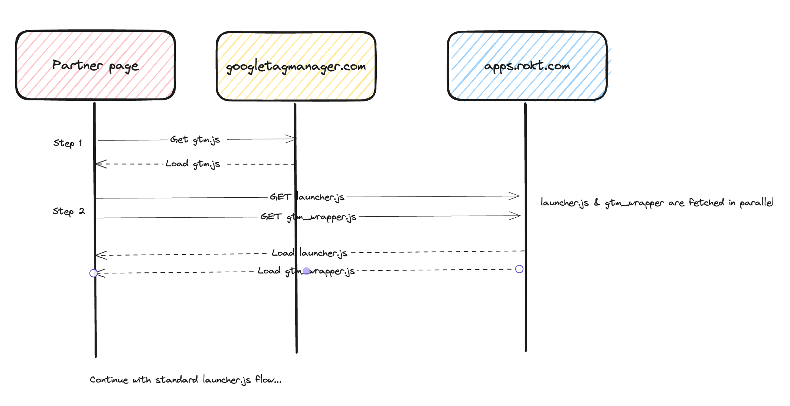

# Google Tag Template

## Resident Experts

- Phi Lieu - phi.lieu@rokt.com
- Matt Bodle - matt.bodle@rokt.com
- John Cao - john.cao@rokt.com
- Yuhan He - yuhan.he@rokt.com

## Overview

Rokt integrates with Google Tag Manager, enabling partners to launch placements through Google's tag management system. Partners can configure their tags on Google's Console instead of managing the Rokt script directly.

Two files make up Rokt's integration with Google Tag.

1. `gtm.js` - This file is created by Google Tag Manager and will be fetched on the partner page through the Google Tag script which they would have injected onto their `<head>` tag. Rokt's tag is implemented in this file along with many other tags.
2. `gtm_wrapper.js` - This file is responsible for extracting all the configurations (i.e Rokt accountId, attributes ...) passed from the `gtm.js` file and coordinates the interaction with the Rokt Launcher and invokes placement selection. Source code can be found in [@ROKT/gtm_wrapper](https://github.com/ROKT/gtm_wrapper). Refer to step 2 in the image below.

**This repository is responsible for building and deploying the Rokt Tag template bundled into gtm.js.**

    

This is a public repository containing the TPL file necessary for Google to support Rokt's application onto the Tag Manager Marketplace.

To use on an adhoc basis -- please download the .tpl file and upload this in your Google Tag Manager Template interface. You can read more about how to do that [here](https://developers.google.com/tag-platform/tag-manager/templates).

[For more info on developing a Google Tag](https://developers.google.com/tag-platform/tag-manager)

## Testing

[Follow these instructions](https://github.com/ROKT/gtm_wrapper/tree/master/docs/guides/how-to-test.md) to set up the Testing Playground and test your template changes.

## Deployment Process

[Follow these steps](https://developers.google.com/tag-platform/tag-manager/templates/gallery#update_your_template) to deploy the template.
